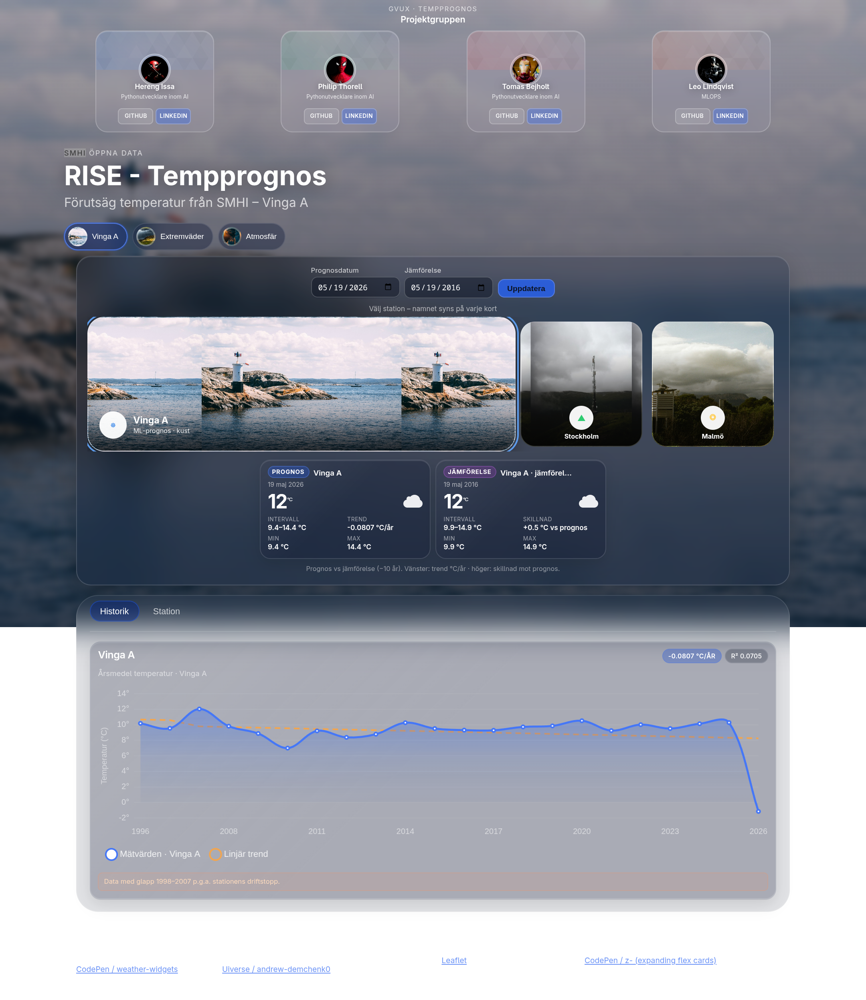

# Tempprognos – Temperature Future Predictor



A machine learning web application that predicts future temperatures for Swedish weather stations using historical SMHI data. Built at the RISE Hackathon by us.

## What it does

- Predicts temperature for any future date at three stations: **Vinga A**, **Stockholm**, and **Malmö**
- Returns a point estimate with confidence bounds (low/mid/high)
- Shows historical annual mean temperatures and long-term trends
- Compares two dates side by side in the UI
- Interactive station map with per-station info

## How it works

Three XGBoost models (low, mid, high quantile) are trained on historical SMHI daily temperature data (`data_combined.csv`). Features: city, day of year, month, year. If the model file is missing, the app falls back to seasonal averages from the raw CSV.

## Project structure

```
RISE-Hackathon/
├── main.py                  # FastAPI app – /predict, /api/historical, /api/trends
├── model/predict.py         # ML inference (XGBoost pkl) + seasonal fallback
├── api/data_service.py      # Station registry, annual means, trend computation
├── app/static/              # Frontend (HTML, CSS, JS, Leaflet map, Chart.js)
├── data/                    # Raw SMHI CSVs + cleaned CSVs per station
├── models/temperature_models.pkl  # Trained XGBoost models
├── forecaster.ipynb         # Model training notebook
├── prepare_data.py          # Raw SMHI CSV → data_clean.csv
├── Dockerfile               # Hugging Face Docker Space (port 7860)
└── requirements.txt
```

## Stations

| Key | Station | Source |
|-----|---------|--------|
| `vinga` | Vinga A (nr 71380) | SMHI – coastal, Gothenburg archipelago |
| `stockholm` | Stockholm | SMHI |
| `malmo` | Malmö | SMHI |

> Vinga A had a data gap roughly **1998–2007** due to station downtime.

## Setup

**Requirements:** Python 3.10+, and on macOS `brew install libomp` if XGBoost fails to load.

```bash
python -m venv .venv
source .venv/bin/activate
pip install -r requirements.txt
```

Prepare cleaned data (only needed if regenerating from raw CSVs):

```bash
python prepare_data.py
```

## Run locally

Start the FastAPI backend

```bash
uvicorn main:app --host 0.0.0.0 --port 8000
```

The server runs on **http://localhost:8000** by default.

Then open the frontend by opening `app/static/index.html` directly in your browser (e.g. `File > Open File` or `open app/static/index.html`). The HTML/JS in `app/static/` is a standalone frontend and does not need a separate web server — just open the file.

## API

| Endpoint | Description |
|----------|-------------|
| `GET /` | Web UI |
| `GET /health` | Status + available stations |
| `GET /api/stations` | List stations |
| `GET /predict?date=YYYY-MM-DD&station=vinga` | Temperature forecast |
| `GET /api/historical?station=vinga` | Annual mean temperatures |
| `GET /api/trends?station=vinga` | Linear trend data |

Example request and response:

```http
GET /predict?date=2028-06-14&station=stockholm
```

```json
{
  "date": "2028-06-14",
  "predicted_temp": 17.3,
  "lower_bound": 14.8,
  "upper_bound": 19.8,
  "station_id": "stockholm",
  "model": "ml"
}
```

## Team

| Name | Role |
|------|------|
| [Hereng Issa](https://github.com/herengissa) | Python / AI developer |
| [Philip Thorell](https://github.com/philipthorell) | Python / AI developer |
| [Tomas Bejholt](https://github.com/tomasbejholt) | Python / AI developer |
| [Leo Lindqvist](https://github.com/LeoLindqvist123) | MLOps |

## Data & licenses

Weather data © [SMHI](https://www.smhi.se/) – cite SMHI as the source in any presentation or report.  
Map: [Leaflet](https://leafletjs.com/) + OpenStreetMap contributors.
